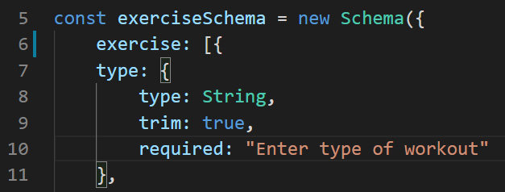

# Workout Tracker

I created the backend for the Workout Tracker by using a Mongo database with Mongoose schema and routes with Express. 

## Routes to no where

At first, I thought I knew routes. This assignment showed I didn't, well the Mongo way. For the life of me I couldn't wrap my brain around findOneAndUpdate. Mahisha was a big help on giving me hints on what to read up on and what I'm missing. I was missing the _id: req.params.id and telling it what I wanted to push to the database. Duh, the /api/workouts/:id was a big hint on what I should have done.

I ask Kerwin, why am I not getting the logging information. I was going to rip my hair on what he said. Look at line 12 on the workout.js, then look at the name of your schema. I was missing a "s" on the array name "exercise".

## Getting Started

To get started using the application, use any web browser to view live link, (https://murmuring-reaches-02765.herokuapp.com/?id=5e3e701f8db42c001777a715). Repository link, (https://github.com/itsmedexter/Workout_Tracker).

## Technolgies Used

* [HTML](https://developer.mozilla.org/en-US/docs/Web/HTML)
* [CSS](https://developer.mozilla.org/en-US/docs/Web/CSS)
* [Bootstrap] (https://stackpath.bootstrapcdn.com/bootstrap/4.3.1/css/bootstrap.min.css)
* [Javascript](https://developer.mozilla.org/en-US/docs/Web/JavaScript)
* [Node](https://nodejs.org/en/)
* [Express](https://expressjs.com/)
* [MongoDB](https://www.mongodb.com/)
* [Mongoose](https://mongoosejs.com)

## Deployed Link

* [See Live Site](https://murmuring-reaches-02765.herokuapp.com/?id=5e3e701f8db42c001777a715)

## Authors

Dexter Valencia 

- [Link to Portfolio Site](https://github.com/itsmedexter/Workout_Tracker)
- [Link to Github](https://github.com/itsmedexter)
- [Link to LinkedIn](https://www.linkedin.com/in/dextervalencia/)

## License

This project is licensed under the MIT License 

## Acknowledgments

* Thanks to Mahisha and Kerwin for helping me get through this.  
